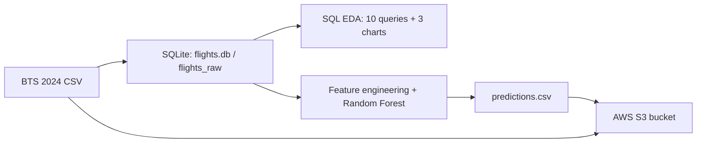

# Flight Delay Analytics

## Overview
This project analyzes ~7 million U.S. domestic flights from the 2024 BTS On-Time Performance data to find out which carriers, months, routes, and causes drive arrival delays. It then trains a Random Forest classifier to predict whether a flight will arrive more than 15 minutes late, and stores the raw data and predictions in AWS S3. The goal is to show an end-to-end workflow: SQL analysis, machine learning, and cloud storage.

## Architecture



1. **Ingestion** — BTS flight records loaded into a SQLite database (`data/flights.db`, table `flights_raw`).
2. **SQL EDA** — 10 queries (`week2_queries.sql`, `week3_queries.sql`) using `GROUP BY`, `HAVING`, and window functions (`RANK()`, `LAG()`); charts saved in `charts/`.
3. **ML model** — Random Forest classifier (`week3_rf_model.ipynb`) predicting `IsDelayed` (arrival delay > 15 min). Saved as `rf_delay_model.joblib`.
4. **AWS S3** — `flights_raw.csv` and `predictions.csv` uploaded with boto3, then read back from S3 to verify (`AWS_flight_data_pred.ipynb`).

## Key SQL Findings
- **Carriers:** American Airlines (AA) has the highest average arrival delay at **15.31 min** (966K flights). Republic Airways (YX) is the only carrier that arrives early on average (**−1.79 min**, 295K flights).
- **Seasonality:** July is the worst month (**18.09 min** average delay, **71.13%** on-time). October is the best (**−1.28 min**, **87.35%** on-time), a swing of over 19 minutes.
- **Causes:** Carrier-related delay makes up **58.1%** of delay minutes (35.8M), NAS/air traffic **31.8%** (19.6M), and weather only **10.1%** (6.2M). Late-arriving aircraft alone adds **41.97M** minutes.
- **Routes:** Hayden, CO → Boston (HDN–BOS) is the worst route at **117.97 min** average delay (32 flights). Most of the worst routes involve small regional airports.
- **Day of week:** Tuesday has the best on-time rate (**81.4%**); Friday has the worst (**76.0%**).

## Model

**Features (7):** carrier, origin, destination, month, day of week, departure hour, distance. Origin/destination are label-encoded (one-hot encoding created 712 columns and made training too slow).
**Split:** 80/20 train/test, stratified (5.59M train / 1.40M test rows).
**Model:** `RandomForestClassifier(n_estimators=200, max_depth=10, class_weight='balanced', random_state=42)`

| Class | Precision | Recall | F1-score | Support |
|---|---|---|---|---|
| OnTime | 0.87 | 0.63 | 0.73 | 1,116,607 |
| Delayed | 0.30 | 0.63 | 0.41 | 280,678 |
| **Accuracy** | | | **0.63** | 1,397,285 |
| Macro avg | 0.59 | 0.63 | 0.57 | |

**Notes:**
- Only 20% of flights are delayed. Without `class_weight='balanced'`, the model predicted every flight as on time: 80% accuracy, but 0% recall on delayed flights. Balancing the classes lowered accuracy but let the model catch **63% of delayed flights**.
- Delayed precision is low (0.30) because the features are schedule-only (carrier, route, time). The model cannot see weather, air traffic, or late-arriving aircraft, which the SQL analysis shows drive most delays.
- **Next steps:** add weather and prior-flight delay features, and tune the decision threshold to trade recall for precision.

## Setup & Reproduce

**Requirements:** Python 3, pandas, scikit-learn, matplotlib, joblib, boto3, DB Browser for SQLite (optional)

```
pip install pandas scikit-learn matplotlib joblib boto3
```

1. **Get the data:** Download 2024 On-Time Performance data from the [BTS TranStats site](https://www.transtats.bts.gov/) and load it into `data/flights.db` as table `flights_raw`.
2. **Run the SQL:** Open `flights.db` in DB Browser for SQLite and run `week2_queries.sql` and `week3_queries.sql`.
3. **Train the model:** Run `week3_rf_model.ipynb` in Jupyter. It saves `rf_delay_model.joblib`, `week3_rf_metrics.txt`, and `predictions.csv`.
4. **Upload to S3:** Create an S3 bucket and AWS access keys. Point boto3 to your credentials file, then run `AWS_flight_data_pred.ipynb`:
   ```
   set AWS_SHARED_CREDENTIALS_FILE=path\to\your\credentials
   ```
   Never put real AWS keys in the notebook or commit them to GitHub.

## Repo Structure
```
├── charts/                    # carrier, monthly trend, cause breakdown charts
├── week2_queries.sql          # queries 1–5
├── week3_queries.sql          # queries 6–10 (window functions)
├── week3_rf_model.ipynb       # feature engineering + Random Forest
├── week3_rf_metrics.txt       # classification report
├── rf_delay_model.joblib      # trained model
├── AWS_flight_data_pred.ipynb # S3 upload + read-back
└── README.md
```

## Tools
Python · SQL (SQLite) · pandas · scikit-learn · matplotlib · AWS S3 (boto3) · Git/GitHub
